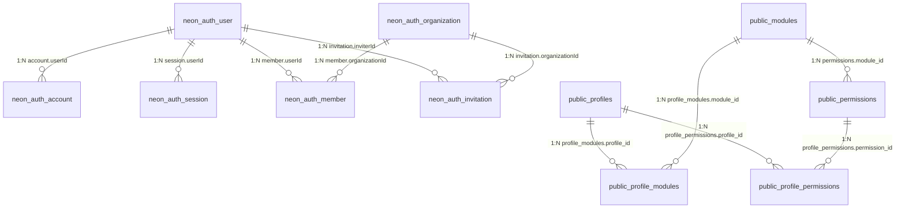

# Estrutura do Banco de Dados - SIGAC

> Documentação completa do schema do banco Neon. A seção `neon_auth` contém as tabelas gerenciadas pelo Neon Auth para autenticação e sessões; `public` contém as tabelas da aplicação SIGAC.

---

## 📊 Visão Geral

| Métrica | Valor |
|---------|-------|
| **Schemas documentados** | 2 (`neon_auth`, `public`) |
| **Total de tabelas** | 41 |
| **Relacionamentos (FK)** | 11 |

---

## 🗂️ Organograma Visual das Relações

---

## 📑 Tabelas por Schema

### Schema: `neon_auth` (Autenticação & Sessões)

Gerenciado pelo **Neon Auth** para garantir segurança e controle de acesso.

---

#### **`user`** – Usuários do Sistema
Armazena dados básicos de cada usuário cadastrado.

| Campo | Tipo | Obrigatório | Padrão | Descrição |
|-------|------|:---:|--------|-----------|
| `id` | `uuid` | ✅ | `gen_random_uuid()` | Identificador único do usuário (PK) |
| `name` | `text` | ✅ | — | Nome completo do usuário |
| `email` | `text` | ✅ | — | Email único do usuário |
| `emailVerified` | `boolean` | ✅ | — | Status de verificação do email |
| `image` | `text` | ❌ | — | URL da foto de perfil |
| `createdAt` | `timestamp tz` | ✅ | `CURRENT_TIMESTAMP` | Data de criação |
| `updatedAt` | `timestamp tz` | ✅ | `CURRENT_TIMESTAMP` | Data da última atualização |
| `role` | `text` | ❌ | — | Papel/função do usuário |
| `banned` | `boolean` | ❌ | — | Indica se o usuário está banido |
| `banReason` | `text` | ❌ | — | Motivo do banimento |
| `banExpires` | `timestamp tz` | ❌ | — | Data de expiração do banimento |

**Relacionamentos:**
- 1:N com `account` (contas de autenticação)
- 1:N com `session` (sessões ativas)
- 1:N com `member` (membros de organizações)
- 1:N com `invitation` (convites enviados)

---

#### **`account`** – Contas de Autenticação
Armazena credenciais e tokens de acesso de provedores.

| Campo | Tipo | Obrigatório | Padrão | Descrição |
|-------|------|:---:|--------|-----------|
| `id` | `uuid` | ✅ | `gen_random_uuid()` | Identificador único (PK) |
| `accountId` | `text` | ✅ | — | ID da conta no provedor |
| `providerId` | `text` | ✅ | — | ID do provedor (ex: `email`, `google`) |
| `userId` | `uuid` | ✅ | — | Referência ao usuário (FK → `user.id`) |
| `accessToken` | `text` | ❌ | — | Token de acesso (sensível) |
| `refreshToken` | `text` | ❌ | — | Token de renovação |
| `idToken` | `text` | ❌ | — | Token de identidade |
| `accessTokenExpiresAt` | `timestamp tz` | ❌ | — | Expiração do access token |
| `refreshTokenExpiresAt` | `timestamp tz` | ❌ | — | Expiração do refresh token |
| `scope` | `text` | ❌ | — | Escopos de permissão |
| `password` | `text` | ❌ | — | Hash da senha (email+password) |
| `createdAt` | `timestamp tz` | ✅ | `CURRENT_TIMESTAMP` | Data de criação |
| `updatedAt` | `timestamp tz` | ✅ | — | Data de atualização |

---

#### **`session`** – Sessões Ativas
Gerencia sessões autenticadas dos usuários.

| Campo | Tipo | Obrigatório | Padrão | Descrição |
|-------|------|:---:|--------|-----------|
| `id` | `uuid` | ✅ | `gen_random_uuid()` | Identificador único (PK) |
| `expiresAt` | `timestamp tz` | ✅ | — | Expiração da sessão |
| `token` | `text` | ✅ | — | Token único de sessão |
| `createdAt` | `timestamp tz` | ✅ | `CURRENT_TIMESTAMP` | Data de criação |
| `updatedAt` | `timestamp tz` | ✅ | — | Data de atualização |
| `ipAddress` | `text` | ❌ | — | IP do cliente |
| `userAgent` | `text` | ❌ | — | User Agent do navegador |
| `userId` | `uuid` | ✅ | — | Referência ao usuário (FK → `user.id`) |
| `impersonatedBy` | `text` | ❌ | — | ID de quem está impersonando (admin) |
| `activeOrganizationId` | `text` | ❌ | — | Organização ativa na sessão |

---

#### **`verification`** – Códigos de Verificação
Armazena códigos temporários para verificação de email e recuperação de senha.

| Campo | Tipo | Obrigatório | Padrão | Descrição |
|-------|------|:---:|--------|-----------|
| `id` | `uuid` | ✅ | `gen_random_uuid()` | Identificador único (PK) |
| `identifier` | `text` | ✅ | — | Email ou identificador verificado |
| `value` | `text` | ✅ | — | Código ou token de verificação |
| `expiresAt` | `timestamp tz` | ✅ | — | Expiração do código |
| `createdAt` | `timestamp tz` | ✅ | `CURRENT_TIMESTAMP` | Data de criação |
| `updatedAt` | `timestamp tz` | ✅ | `CURRENT_TIMESTAMP` | Data de atualização |

---

#### **`organization`** – Organizações
Agrupa usuários em organizações (B2B/multi-tenant).

| Campo | Tipo | Obrigatório | Padrão | Descrição |
|-------|------|:---:|--------|-----------|
| `id` | `uuid` | ✅ | `gen_random_uuid()` | Identificador único (PK) |
| `name` | `text` | ✅ | — | Nome da organização |
| `slug` | `text` | ✅ | — | Slug único para URL |
| `logo` | `text` | ❌ | — | URL do logo |
| `createdAt` | `timestamp tz` | ✅ | — | Data de criação |
| `metadata` | `text` | ❌ | — | Dados adicionais em JSON |

---

#### **`member`** – Membros de Organizações
Associa usuários a organizações com papéis específicos.

| Campo | Tipo | Obrigatório | Padrão | Descrição |
|-------|------|:---:|--------|-----------|
| `id` | `uuid` | ✅ | `gen_random_uuid()` | Identificador único (PK) |
| `organizationId` | `uuid` | ✅ | — | Referência à organização (FK) |
| `userId` | `uuid` | ✅ | — | Referência ao usuário (FK) |
| `role` | `text` | ✅ | — | Papel na organização (admin, member, viewer) |
| `createdAt` | `timestamp tz` | ✅ | — | Data de adesão |

---

#### **`invitation`** – Convites
Gerencia convites para novas membros em organizações.

| Campo | Tipo | Obrigatório | Padrão | Descrição |
|-------|------|:---:|--------|-----------|
| `id` | `uuid` | ✅ | `gen_random_uuid()` | Identificador único (PK) |
| `organizationId` | `uuid` | ✅ | — | Organização do convite (FK) |
| `email` | `text` | ✅ | — | Email do convidado |
| `role` | `text` | ❌ | — | Papel proposto |
| `status` | `text` | ✅ | — | Status do convite (pending, accepted, rejected) |
| `expiresAt` | `timestamp tz` | ✅ | — | Data de expiração |
| `createdAt` | `timestamp tz` | ✅ | `CURRENT_TIMESTAMP` | Data de criação |
| `inviterId` | `uuid` | ✅ | — | Quem criou o convite (FK → `user.id`) |

---

#### **`jwks`** – JWT Key Set
Armazena chaves públicas/privadas para assinatura de JWT.

| Campo | Tipo | Obrigatório | Padrão | Descrição |
|-------|------|:---:|--------|-----------|
| `id` | `uuid` | ✅ | `gen_random_uuid()` | Identificador único (PK) |
| `publicKey` | `text` | ✅ | — | Chave pública |
| `privateKey` | `text` | ✅ | — | Chave privada (sensível) |
| `createdAt` | `timestamp tz` | ✅ | — | Data de criação |
| `expiresAt` | `timestamp tz` | ❌ | — | Data de expiração |

---

#### **`project_config`** – Configuração do Projeto
Armazena configurações gerais do Neon Auth.

| Campo | Tipo | Obrigatório | Padrão | Descrição |
|-------|------|:---:|--------|-----------|
| `id` | `uuid` | ✅ | `gen_random_uuid()` | Identificador único (PK) |
| `name` | `text` | ✅ | — | Nome do projeto |
| `endpoint_id` | `text` | ✅ | — | ID do endpoint Neon |
| `created_at` | `timestamp tz` | ✅ | `CURRENT_TIMESTAMP` | Data de criação |
| `updated_at` | `timestamp tz` | ✅ | `CURRENT_TIMESTAMP` | Data de atualização |
| `trusted_origins` | `jsonb` | ✅ | — | URLs confiáveis para CORS |
| `social_providers` | `jsonb` | ✅ | — | Configuração de provedores sociais |
| `email_provider` | `jsonb` | ❌ | — | Config do provedor de email |
| `email_and_password` | `jsonb` | ❌ | — | Config de email+password |
| `allow_localhost` | `boolean` | ✅ | — | Permite localhost em development |
| `plugin_configs` | `jsonb` | ❌ | — | Configurações de plugins |
| `webhook_config` | `jsonb` | ❌ | — | URLs de webhook |

---

### Schema: `public` (Aplicação SIGAC)

Tabelas de negócio do sistema de gestão de acesso a armazenamento científico.

---

#### **`profiles`** – Perfis de Acesso
Define papéis/grupos de permissões.

| Campo | Tipo | Obrigatório | Padrão | Descrição |
|-------|------|:---:|--------|-----------|
| `id` | `char varying` | ✅ | — | ID único do perfil (PK) |
| `name` | `char varying` | ✅ | — | Nome do perfil |
| `description` | `char varying` | ✅ | — | Descrição das responsabilidades |
| `created_at` | `timestamp` | ✅ | — | Data de criação |

**Relacionamentos:**
- 1:N com `profile_modules` (módulos acessíveis)
- 1:N com `profile_permissions` (permissões)

---

#### **`modules`** – Módulos do Sistema
Componentes funcionais da aplicação.

| Campo | Tipo | Obrigatório | Padrão | Descrição |
|-------|------|:---:|--------|-----------|
| `id` | `char varying` | ✅ | — | ID único (PK) |
| `name` | `char varying` | ✅ | — | Nome do módulo |
| `route` | `char varying` | ✅ | — | Rota no frontend |
| `icon` | `char varying` | ✅ | — | Ícone do módulo |
| `display_order` | `integer` | ✅ | — | Ordem de exibição |
| `active` | `boolean` | ✅ | — | Ativo/Inativo |

**Relacionamentos:**
- 1:N com `permissions` (permissões por módulo)
- 1:N com `profile_modules` (acesso de perfis)

---

#### **`permissions`** – Permissões
Ações específicas dentro de módulos.

| Campo | Tipo | Obrigatório | Padrão | Descrição |
|-------|------|:---:|--------|-----------|
| `id` | `char varying` | ✅ | — | ID único (PK) |
| `module_id` | `char varying` | ✅ | — | Módulo (FK → `modules.id`) |
| `name` | `char varying` | ✅ | — | Nome da permissão |
| `description` | `text` | ✅ | — | O que a permissão permite |
| `active` | `boolean` | ✅ | — | Ativa/Inativa |

**Relacionamentos:**
- 1:N com `profile_permissions` (atribuição a perfis)

---

#### **`profile_modules`** – Acesso de Perfis a Módulos
Define quais módulos um perfil pode visualizar.

| Campo | Tipo | Obrigatório | Padrão | Descrição |
|-------|------|:---:|--------|-----------|
| `profile_id` | `char varying` | ✅ | — | Perfil (FK → `profiles.id`) |
| `module_id` | `char varying` | ✅ | — | Módulo (FK → `modules.id`) |
| `can_view` | `boolean` | ✅ | — | Pode visualizar o módulo |

---

#### **`profile_permissions`** – Permissões de Perfis
Define permissões específicas por perfil.

| Campo | Tipo | Obrigatório | Padrão | Descrição |
|-------|------|:---:|--------|-----------|
| `profile_id` | `char varying` | ✅ | — | Perfil (FK → `profiles.id`) |
| `permission_id` | `char varying` | ✅ | — | Permissão (FK → `permissions.id`) |
| `allowed` | `boolean` | ✅ | — | Permitido/Proibido |

---

#### **`projects`** – Projetos de Pesquisa
Projetos e espaços de armazenamento científico.

| Campo | Tipo | Obrigatório | Padrão | Descrição |
|-------|------|:---:|--------|-----------|
| `id` | `text` | ❌ | — | ID único (PK) |
| `name` | `text` | ❌ | — | Nome do projeto |
| `code` | `text` | ❌ | — | Código de referência |
| `responsible_area` | `text` | ❌ | — | Área responsável |
| `managers_ids` | `jsonb` | ❌ | — | Array de IDs de gerenciadores |
| `write_group` | `text` | ❌ | — | Grupo com permissão de escrita |
| `read_group` | `text` | ❌ | — | Grupo com permissão de leitura |
| `write_identity_role` | `text` | ❌ | — | Role do identity para escrita |
| `read_identity_role` | `text` | ❌ | — | Role do identity para leitura |
| `snow_task_number` | `text` | ❌ | — | Número de task no ServiceNow |
| `parent_folder` | `text` | ❌ | — | ID da pasta pai |
| `description` | `text` | ❌ | — | Descrição do projeto |
| `status` | `text` | ❌ | — | Status (ativo, suspenso, arquivado) |
| `participants_ids` | `jsonb` | ❌ | — | Array de IDs de participantes |
| `created_at` | `timestamp` | ❌ | — | Data de criação |
| `updated_at` | `timestamp` | ❌ | — | Data de atualização |

---

#### **`files`** – Arquivos
Hierarquia de documentos/arquivos no armazenamento.

| Campo | Tipo | Obrigatório | Padrão | Descrição |
|-------|------|:---:|--------|-----------|
| `id` | `text` | ❌ | — | ID único (PK) |
| `project_id` | `text` | ❌ | — | Projeto proprietário |
| `parent_id` | `text` | ❌ | — | ID da pasta pai (auto-referência) |
| `kind` | `text` | ❌ | — | Tipo (file, folder) |
| `name` | `text` | ❌ | — | Nome do arquivo/pasta |
| `size_bytes` | `integer` | ❌ | — | Tamanho em bytes |
| `mime_type` | `text` | ❌ | — | Tipo MIME (ex: application/pdf) |
| `created_by` | `text` | ❌ | — | ID do usuário criador |
| `created_at` | `timestamp` | ❌ | — | Data de criação |
| `updated_at` | `timestamp` | ❌ | — | Data de atualização |

---

#### **`file_permissions`** – Permissões de Arquivo
Controle granular de acesso a arquivos individuais.

| Campo | Tipo | Obrigatório | Padrão | Descrição |
|-------|------|:---:|--------|-----------|
| `file_id` | `text` | ❌ | — | Arquivo (FK → `files.id`) |
| `user_id` | `text` | ❌ | — | Usuário com acesso |
| `group_id` | `text` | ❌ | — | Grupo com acesso |
| `level` | `text` | ❌ | — | Nível (read, write, admin) |
| `inherited_from` | `text` | ❌ | — | ID do arquivo pai (herança) |
| `created_at` | `timestamp` | ❌ | — | Data de criação |

---

#### **`project_members`** – Membros de Projeto
Usuários participantes de um projeto.

| Campo | Tipo | Obrigatório | Padrão | Descrição |
|-------|------|:---:|--------|-----------|
| `project_id` | `text` | ❌ | — | Projeto |
| `user_id` | `text` | ❌ | — | Usuário |
| `papel` | `text` | ❌ | — | Papel (gerenciador, colaborador, visualizador) |
| `created_at` | `timestamp` | ❌ | — | Data de adesão |

---

#### **`activity_logs`** – Logs de Atividade
Auditoria de ações no sistema.

| Campo | Tipo | Obrigatório | Padrão | Descrição |
|-------|------|:---:|--------|-----------|
| `id` | `text` | ❌ | — | ID único (PK) |
| `user_id` | `text` | ❌ | — | Usuário que executou a ação |
| `action` | `text` | ❌ | — | Tipo de ação (create, update, delete) |
| `entity` | `text` | ❌ | — | Entidade afetada (files, projects) |
| `entity_id` | `text` | ❌ | — | ID da entidade |
| `details` | `text` | ❌ | — | Detalhes adicionais (JSON) |
| `created_at` | `timestamp` | ❌ | — | Data da ação |

---

#### **`project_statuses`** – Status de Projeto
Estados possíveis de um projeto.

| Campo | Tipo | Obrigatório | Padrão | Descrição |
|-------|------|:---:|--------|-----------|
| `id` | `char varying` | ✅ | — | ID único (PK) |
| `code` | `char varying` | ✅ | — | Código do status |
| `nome` | `char varying` | ✅ | — | Nome amigável |
| `color` | `char varying` | ✅ | — | Cor para exibição |
| `display_order` | `integer` | ✅ | — | Ordem no dropdown |
| `active` | `boolean` | ✅ | — | Ativo/Inativo |
| `allows_edit` | `boolean` | ✅ | — | Permite edição neste status |

---

#### **`project_types`** – Tipos de Projeto
Categorias de projetos.

| Campo | Tipo | Obrigatório | Padrão | Descrição |
|-------|------|:---:|--------|-----------|
| `id` | `char varying` | ✅ | — | ID único (PK) |
| `code` | `char varying` | ✅ | — | Código |
| `nome` | `char varying` | ✅ | — | Nome do tipo |
| `description` | `text` | ✅ | — | Descrição |
| `active` | `boolean` | ✅ | — | Ativo/Inativo |

---

#### **`responsible_areas`** – Áreas Responsáveis
Departamentos/áreas responsáveis por projetos.

| Campo | Tipo | Obrigatório | Padrão | Descrição |
|-------|------|:---:|--------|-----------|
| `id` | `char varying` | ✅ | — | ID único (PK) |
| `name` | `char varying` | ✅ | — | Nome da área |
| `prefix` | `char varying` | ✅ | — | Prefixo para IDs de projeto |
| `next_number` | `integer` | ✅ | — | Próximo número sequencial |
| `active` | `boolean` | ✅ | — | Ativa/Inativa |
| `created_at` | `timestamp` | ✅ | — | Data de criação |
| `updated_at` | `timestamp` | ✅ | — | Data de atualização |

---

#### **`system_settings`** – Configurações Globais
Parâmetros de sistema.

| Campo | Tipo | Obrigatório | Padrão | Descrição |
|-------|------|:---:|--------|-----------|
| `key` | `char varying` | ✅ | — | Chave única (PK) |
| `value` | `text` | ✅ | — | Valor armazenado |
| `value_type` | `char varying` | ✅ | — | Tipo (string, boolean, json) |
| `description` | `text` | ✅ | — | Descrição da config |
| `group_name` | `char varying` | ✅ | — | Categoria/grupo |
| `active` | `boolean` | ✅ | — | Ativa/Inativa |

---

#### **`report_types`** – Tipos de Relatório
Modelos de relatórios disponíveis.

| Campo | Tipo | Obrigatório | Padrão | Descrição |
|-------|------|:---:|--------|-----------|
| `id` | `char varying` | ✅ | — | ID único (PK) |
| `code` | `char varying` | ✅ | — | Código |
| `name` | `char varying` | ✅ | — | Nome |
| `description` | `text` | ✅ | — | Descrição |
| `formats` | `text` | ✅ | — | Formatos suportados (csv, pdf, xlsx) |
| `active` | `boolean` | ✅ | — | Ativo/Inativo |

---

#### **`report_fields`** – Campos de Relatório
Colunas configuráveis para cada tipo de relatório.

| Campo | Tipo | Obrigatório | Padrão | Descrição |
|-------|------|:---:|--------|-----------|
| `id` | `char varying` | ✅ | — | ID único (PK) |
| `report_code` | `char varying` | ✅ | — | Tipo de relatório |
| `field_key` | `char varying` | ✅ | — | Chave da coluna |
| `label` | `char varying` | ✅ | — | Rótulo exibido |
| `source_key` | `char varying` | ✅ | — | Chave na fonte de dados |
| `display_order` | `integer` | ✅ | — | Ordem de exibição |
| `active` | `boolean` | ✅ | — | Ativo/Inativo |

---

#### **`users`** – Usuários da Aplicação (Legacy)
Tabela redundante com dados de usuários (duplicada da `neon_auth.user`).

| Campo | Tipo | Obrigatório | Padrão | Descrição |
|-------|------|:---:|--------|-----------|
| `id` | `text` | ❌ | — | ID único (PK) |
| `name` | `text` | ❌ | — | Nome |
| `email` | `text` | ❌ | — | Email |
| `cargo` | `text` | ❌ | — | Cargo |
| `area` | `text` | ❌ | — | Área |
| `role` | `text` | ❌ | — | Papel |
| `perfil_id` | `text` | ❌ | — | ID do perfil |
| `created_at` | `timestamp` | ❌ | — | Data de criação |
| `avatar_url` | `text` | ❌ | — | URL do avatar |
| `last_login_at` | `timestamp` | ❌ | — | Último login |
| `job_title` | `char varying` | ❌ | — | Título do job |
| `profile_id` | `char varying` | ❌ | — | ID do profile |

---

#### Tabelas Adicionais (Configuração/Legacy)

- **`sessions`** – Sessões legacy
- **`menus`** – Menu dinâmico
- **`modulos`** – Módulos legacy (português)
- **`perfis`** – Perfis legacy
- **`permissoes`** – Permissões legacy
- **`file_shares`** – Compartilhamento de arquivos
- **`configuracoes_sistema`** – Configurações legacy

---

## 🔐 Regras de Segurança

1. **Sensibilidade de Dados:**
   - Campos `password`, `accessToken`, `refreshToken`, `privateKey` são sensíveis — **nunca registre nem exporte sem encriptação**.
   - Use `neon_auth` apenas para queries autenticadas.

2. **Integridade Referencial:**
   - Chaves estrangeiras garantem que usuários, organizações e permissões permaneçam sincronizados.
   - Deletar um usuário deve remover suas contas, sessões e membros cascata.

3. **Autoria & Auditoria:**
   - Sempre registre `created_by` em `files` e ações em `activity_logs`.
   - Use `createdAt` e `updatedAt` para rastreability.

4. **Controle de Acesso:**
   - Validar `profile_modules` antes de renderizar módulos no frontend.
   - Aplicar `profile_permissions` no backend (Server Actions) antes de mutations.

---

## 📝 Notas Importantes

- **Duplicação de Schemas:** Tabelas como `modules`/`modulos`, `profiles`/`perfis`, `permissions`/`permissoes` existem em ambos os idiomas. Considere consolidar para evitar inconsistências.
- **Estado de Sincronização:** Tabela `users` (legacy) pode ficar desatualizada em relação a `neon_auth.user`. Planejar migração.
- **Campos Anulados:** Muitas colunas de `public` aceitam `NULL`. Isso oferece flexibilidade mas também risco de dados parciais. Validar em aplicação.

---

**Última atualização:** 12/09/2026  
**Versão do Schema:** 1.0
