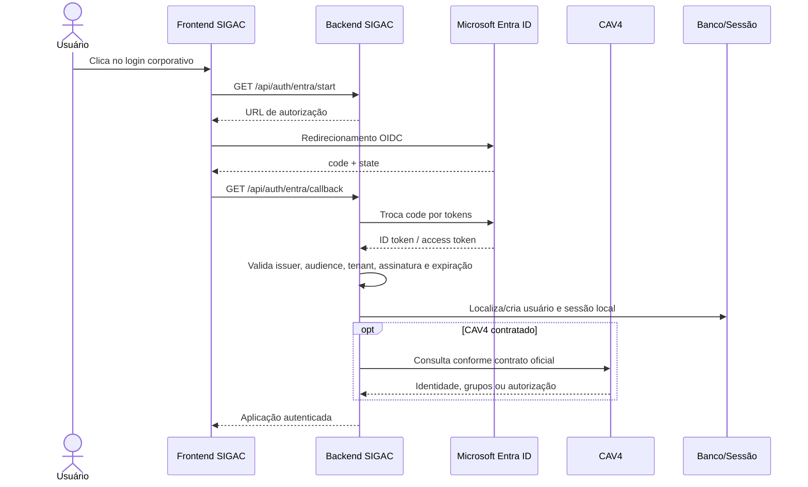

# Integração de login corporativo — CAV4 e Microsoft Entra ID

> Guia prático para entender o que o SIGAC precisa receber, configurar e validar. Não contém valores secretos.

## 1. Resumo executivo

O login corporativo pode envolver dois sistemas diferentes:

- **Microsoft Entra ID:** provedor de identidade OIDC. Autentica o usuário e entrega uma identidade validável.
- **CAV4:** integração corporativa ainda dependente de contrato técnico oficial. Não devemos inventar endpoints, chaves ou formato de token.

O CAV4 será o provedor principal de autenticação quando o contrato técnico estiver disponível. O backend do SIGAC validará o retorno, localizará o usuário local, aplicará papéis e permissões e criará a sessão. Enquanto o contrato não existir, a integração permanece desligada e não simula login.

## 2. Fluxo visual



## 3. O que o Entra ID precisa fornecer

| Informação | Variável | Obrigatória | Observação |
|---|---|---:|---|
| Directory/Tenant ID | `ENTRA_TENANT_ID` | Sim | Identifica o tenant corporativo. |
| Application/Client ID | `ENTRA_CLIENT_ID` | Sim | Identifica o app registrado. |
| Client Secret | `ENTRA_CLIENT_SECRET` | Sim no backend | Nunca vai para o frontend ou Git. |
| Callback | `ENTRA_REDIRECT_URI` | Sim | Deve ser idêntico ao cadastrado no Portal Entra. |
| Logout callback | `ENTRA_POST_LOGOUT_REDIRECT_URI` | Recomendado | Retorno após logout federado. |
| Issuer/Authority | `ENTRA_ISSUER` / `ENTRA_AUTHORITY` | Recomendado | Deve apontar para o tenant correto. |
| Escopos | `ENTRA_SCOPES` | Sim | Mínimo: `openid profile email`. |

### Redirect URIs

Cadastrar uma URI exata para cada ambiente:

```text
Desenvolvimento: http://localhost:8000/api/auth/entra/callback
Homologação:     https://hml.exemplo.com/api/auth/entra/callback
Produção:        https://sigac.exemplo.com/api/auth/entra/callback
```

Os domínios acima são exemplos. Devem ser substituídos pelos endereços oficiais.

## 4. Variáveis de ambiente

### Backend

```env
ENTRA_ENABLED=false
ENTRA_TENANT_ID=
ENTRA_CLIENT_ID=
ENTRA_CLIENT_SECRET=
ENTRA_ISSUER=
ENTRA_AUTHORITY=
ENTRA_REDIRECT_URI=
ENTRA_POST_LOGOUT_REDIRECT_URI=
ENTRA_SCOPES=openid profile email
ENTRA_AUTO_CREATE_USER=false

# Preencher somente após o contrato CAV4 ser aprovado
CAV4_ENABLED=false
CAV4_BASE_URL=
CAV4_CLIENT_ID=
CAV4_CLIENT_SECRET=
CAV4_ISSUER=
CAV4_AUDIENCE=
CAV4_API_KEY=
```

| Variável | Uso | Exposição |
|---|---|---|
| `ENTRA_ENABLED` / `CAV4_ENABLED` | Liga ou desliga o provedor. | Somente backend. |
| `ENTRA_TENANT_ID` | Restringe o tenant. | Configuração privada. |
| `ENTRA_CLIENT_ID` | Identifica a aplicação. | Não usar no frontend sem necessidade. |
| `ENTRA_CLIENT_SECRET` | Troca o código por tokens. | **Nunca expor.** |
| `CAV4_CLIENT_SECRET` / `CAV4_API_KEY` | Credencial CAV4, se o contrato exigir. | **Nunca expor.** |
| `*_REDIRECT_URI` | Callback do provedor. | Deve ser exata. |

O frontend não deve receber `CLIENT_SECRET`, API keys, access tokens ou chaves privadas. Nunca registrar esses valores em logs.

## 5. Permissões mínimas no Entra

Solicitar somente:

- `openid` — habilita identificação OIDC.
- `profile` — informações básicas do perfil.
- `email` — e-mail quando disponível.
- `offline_access` — somente se houver necessidade real de renovação de token.
- `User.Read` — somente se o Graph for usado.
- `GroupMember.Read.All` — somente com aprovação de segurança; é privilegiada.

Preferir App Roles próprias do SIGAC em vez de permissões amplas do Graph:

```text
SIGAC.Admin
SIGAC.Manager
SIGAC.Sponsor
SIGAC.Auditor
SIGAC.Requester
```

## 6. Claims necessários

| Claim | Uso |
|---|---|
| `iss` | Validar emissor. |
| `aud` | Confirmar que o token é para o SIGAC. |
| `exp` / `nbf` | Validar validade. |
| `tid` | Confirmar o tenant permitido. |
| `oid` | Identificador estável do usuário no tenant. Preferido para vínculo. |
| `sub` | Identificador do sujeito no contexto do app. |
| `name` | Nome de exibição. |
| `preferred_username` / `email` | Login e contato, quando disponíveis. |
| `roles` / `groups` | Autorização corporativa, se aprovada. |

Não usar e-mail como única chave de identidade, pois ele pode mudar. O vínculo local deve guardar tenant + `oid` e, quando necessário, `sub`.

## 7. Endpoints do Entra ID

A URL oficial deve vir do discovery do tenant:

```text
GET  https://login.microsoftonline.com/{tenant}/v2.0/.well-known/openid-configuration
GET  https://login.microsoftonline.com/{tenant}/oauth2/v2.0/authorize
POST https://login.microsoftonline.com/{tenant}/oauth2/v2.0/token
GET  https://graph.microsoft.com/oidc/userinfo       # somente se necessário
GET  https://login.microsoftonline.com/{tenant}/oauth2/v2.0/logout
```

## 8. Endpoints internos do SIGAC

| Método | Endpoint | Finalidade |
|---|---|---|
| `GET` | `/api/auth/entra/start` | Inicia o redirecionamento OIDC. |
| `GET` | `/api/auth/entra/callback` | Recebe o código e cria a sessão local. |
| `POST` | `/api/auth/logout` | Encerra a sessão local. |
| `GET` | `/api/auth/session` | Retorna a sessão atual. |
| `GET` | `/api/auth/me` | Dados mínimos do usuário autenticado, se habilitado. |

Os endpoints `CAV4` somente devem ser adicionados quando o contrato for recebido. Possíveis endpoints, ainda **não confirmados**:

```text
GET /api/auth/cav4/start
GET /api/auth/cav4/callback
GET /api/auth/cav4/metadata
```

O callback deve validar `state`, `nonce`, PKCE, issuer, audience, tenant, assinatura, expiração e usuário autorizado.

## 9. O que o CAV4 precisa fornecer

Solicitar formalmente, sem dados reais no documento:

| Item | Pergunta necessária |
|---|---|
| Finalidade | Autentica, fornece autorização ou apenas consulta dados? |
| URL | Qual base URL de desenvolvimento, homologação e produção? |
| Endpoint | Qual endpoint de login, token, perfil e logout? |
| Método | REST, SOAP, OIDC, SAML, redirect ou outro? |
| Autenticação | API key, Basic, OAuth2, JWT, mTLS ou certificado? |
| Chaves | Quem fornece client ID, secret, API key ou certificado? |
| Request | Quais campos e headers são obrigatórios? |
| Response | Quais campos representam matrícula, e-mail, grupos e status? |
| Erros | O que significam 401, 403, 404, 409 e 5xx? |
| Rede | Precisa de VPN, allowlist, proxy ou mTLS? |
| Limites | Timeout, retry, rate limit e SLA? |
| Logout | Logout local ou também remoto? |
| Operação | Quem faz rotação de chaves e presta suporte? |

### Contrato mínimo a preencher

```text
Nome do serviço:
Owner técnico:
Base URL homologação:
Base URL produção:
Endpoint:
Método:
Content-Type:
Autenticação:
Headers:
Request anonimizado:
Response de sucesso anonimizado:
Response de erro:
Timeout:
Retry:
Rate limit:
Requisitos de rede:
Processo de rotação:
Contato de suporte:
```

Sem esse contrato, CAV4 deve permanecer como integração pendente.

## 10. Segurança

- Usar Authorization Code + PKCE.
- Validar tenant, issuer, audience, assinatura e expiração no backend.
- Validar `state` e `nonce` contra replay e CSRF.
- Usar cookies `HttpOnly`, `Secure` e `SameSite` adequado.
- Nunca usar `localStorage` para tokens.
- Separar credenciais por ambiente.
- Aplicar timeout e retry limitado no CAV4.
- Redigir tokens, cookies, secrets e PII nos logs.
- Rotacionar secrets e certificados antes do vencimento.
- Negar por padrão claims/roles não mapeados.
- Registrar login, logout, falhas e provisionamento na auditoria.

## 11. Checklist Entra ID

- [ ] App Registration no tenant correto.
- [ ] Tipo de conta restrito ao tenant corporativo.
- [ ] Redirect URI exata por ambiente.
- [ ] Secret ou certificado com expiração controlada.
- [ ] Escopos mínimos aprovados.
- [ ] Claims disponíveis no token.
- [ ] App Roles ou grupos definidos.
- [ ] Usuários de teste atribuídos.
- [ ] MFA e Conditional Access testados.
- [ ] Logout e expiração testados.
- [ ] Responsável e suporte registrados.

## 12. Checklist CAV4

- [ ] Contrato técnico oficial recebido.
- [ ] URLs de homologação e produção confirmadas.
- [ ] Método de autenticação definido.
- [ ] Credenciais entregues por canal seguro.
- [ ] Request/response anonimizados documentados.
- [ ] Timeout, retry e rate limit definidos.
- [ ] Mapeamento de identidade aprovado.
- [ ] Códigos de erro conhecidos.
- [ ] Indisponibilidade testada.
- [ ] Rotação e revogação definidas.
- [ ] Owner técnico e SLA definidos.

## 13. Testes de aceite

1. Login válido no tenant correto.
2. Usuário de outro tenant rejeitado.
3. `state` ou `nonce` inválido rejeitado.
4. Código expirado ou reutilizado rejeitado.
5. Token com issuer/audience incorretos rejeitado.
6. Usuário sem perfil SIGAC tratado pela política definida.
7. Usuário desabilitado rejeitado.
8. Sessão criada e encerrada corretamente.
9. CAV4 indisponível sem loop de retry.
10. Logs sem tokens, secrets ou PII desnecessária.

## 14. Responsabilidades

| Responsável | Entrega |
|---|---|
| Identidade corporativa | Tenant, app, redirect URI, claims e permissões. |
| CAV4 | Contrato, endpoints, autenticação, payloads e suporte. |
| Backend SIGAC | Validação, integração server-side, sessão e auditoria. |
| Frontend SIGAC | Botão, redirecionamento e mensagens. |
| Segurança | Escopos, secrets, certificados, logs e rotação. |

## 15. Resumo final

Para o **Entra ID**, são necessários: tenant ID, client ID, secret ou certificado, redirect URI, escopos, claims e App Roles aprovadas.

Para o **CAV4**, são necessários: endpoint oficial, método, autenticação, chaves, payloads, respostas, erros, ambientes, rede, timeout, retry, SLA e owner técnico. Sem essas informações, não é seguro implementar a integração.

> Valores reais devem existir somente no gerenciador seguro de secrets do backend.

## Referências oficiais

- OIDC: https://learn.microsoft.com/entra/identity-platform/v2-protocols-oidc
- OAuth Authorization Code: https://learn.microsoft.com/entra/identity-platform/v2-oauth2-auth-code-flow
- Graph permissions: https://learn.microsoft.com/graph/permissions-reference
- App roles: https://learn.microsoft.com/entra/identity-platform/howto-add-app-roles-in-apps
