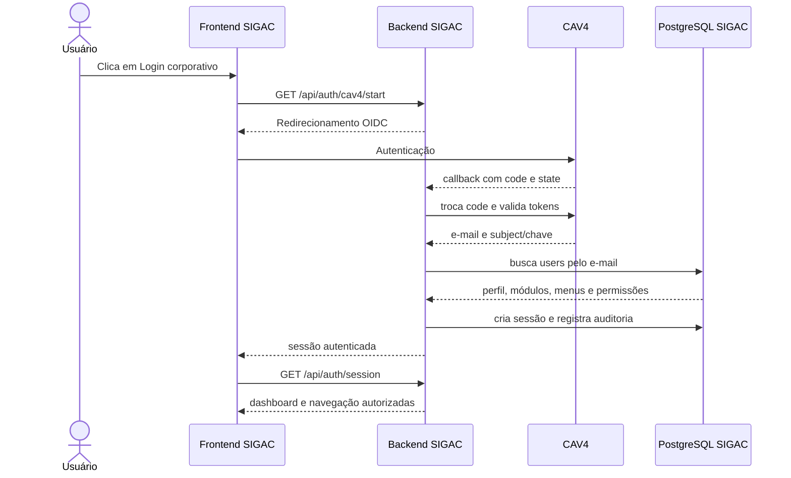

# Login corporativo do SIGAC — CAV4

**Status:** fluxo vigente do SIGAC
**Escopo:** autenticação de identidade; autorização permanece no banco do SIGAC

## Regra principal

O SIGAC utiliza o CAV4 somente para autenticar o usuário. A POC em `cav4-integracao/` é uma referência de consulta e não faz parte da aplicação principal; não deve ser alterada para corrigir o SIGAC.

Após a autenticação, o backend:

1. valida o retorno OIDC do CAV4;
2. extrai o e-mail e o subject/chave corporativa;
3. procura o e-mail na tabela `users`;
4. rejeita usuários sem cadastro ativo ou sem perfil;
5. carrega `profiles`, `modules`, `menus`, `dashboard_cards`, `permissions`, `profile_modules`, `profile_permissions` e `menu_permissions`;
6. cria a sessão local HttpOnly;
7. entrega ao frontend somente a identidade e os recursos autorizados pelo SIGAC.

O CAV4 não concede administrador, menus ou permissões funcionais. Esses dados são sempre definidos pelas tabelas locais.

## Fluxo



## Endpoints do SIGAC

| Método | Endpoint | Uso |
|---|---|---|
| `GET` | `/api/auth/cav4/start` | Inicia o login corporativo. |
| `GET` | `/api/auth/cav4/callback` | Recebe e valida o retorno do CAV4. |
| `GET` | `/api/auth/session` | Retorna a sessão, perfil e permissões locais. |
| `POST` | `/api/auth/logout` | Encerra a sessão local. |

A página `/login` não consulta o banco nem o provedor ao ser aberta. A comunicação com o CAV4 começa somente após o clique no botão corporativo.

## Dados aceitos do CAV4

| Dado | Uso no SIGAC | Pode ser exibido no perfil |
|---|---|---|
| E-mail | Correlação com `users.email` | Sim |
| Nome | Informação de identidade, quando disponível | Sim |
| Subject/chave | Rastreabilidade da identidade CAV4 | Sim, sem token |
| Token/access token | Validação server-side | Nunca |
| Roles/grupos | Informativos, salvo regra formal aprovada | Não definem autorização |

O e-mail é o identificador de correlação funcional usado nesta fase. O subject/chave deve ser preservado para rastreabilidade, mas não substitui o cadastro local.

## Configuração

As variáveis ficam no backend e nunca no frontend:

```env
CAV4_ENABLED=true
CA_CLIENT_ID=
CA_CLIENT_SECRET=
CA_REDIRECT_URI=http://localhost:8080/api/auth/cav4/callback
CA_SCOPES=openid profile email
OIDC_DISCOVERY_URL=
CA_API_BASE_URL=
CA_USERINFO_URL=
CA_SSL_VERIFY=true
CA_SSL_USE_TRUSTSTORE=true
CA_SSL_CERT_FILE=
```

`CA_USERINFO_URL` só é necessário quando o e-mail não estiver disponível no `id_token`. `CA_API_BASE_URL` só é necessário para a chamada oficial de identidade do CAV4, se o contrato exigir. Não criar endpoints ou variáveis com base na POC sem confirmação do contrato do CAV4.

## Segurança

- Validar `state`, `nonce`, PKCE quando configurado, issuer, audience, assinatura e expiração.
- Usar cookies HttpOnly e Secure em HTTPS.
- Não armazenar tokens em `localStorage`.
- Nunca registrar tokens, secrets, cookies ou payloads sensíveis.
- Aplicar timeout e retry limitado nas chamadas ao CAV4.
- Retornar `401` para sessão ausente e `403` para usuário sem autorização local.
- Aplicar a autorização novamente em todos os endpoints protegidos.

## Autorização local

A sessão é montada a partir destas relações:

```text
users.profile_id -> profiles
profiles -> profile_modules -> modules
profiles -> profile_permissions -> permissions
profiles -> menu_permissions -> menus
modules -> menus
```

O perfil administrador deve ser carregado por seed idempotente para todas as entidades ativas. Scripts relacionados:

- `back-end/database/0032_seed_admin_menu_permissions.sql`
- `back-end/database/0033_corrigir_permissoes_e_catalogos.sql`

## Ambientes

Cada ambiente deve possuir client ID, secret, discovery URL, API URL e redirect URI próprios. A callback precisa estar cadastrada exatamente no CAV4:

```text
Local:          http://localhost:8080/api/auth/cav4/callback
Homologação:    https://<dominio-hml>/api/auth/cav4/callback
Produção:       https://<dominio-prod>/api/auth/cav4/callback
```

Os valores reais ficam no Secret Manager/Vercel/ambiente de execução, nunca neste arquivo.

## Critérios de aceite

- A POC permanece sem alterações.
- O login só inicia após o clique corporativo.
- O CAV4 autentica e fornece e-mail/identidade.
- O SIGAC localiza o usuário pelo e-mail.
- Perfil, menus, dashboard e permissões vêm do banco SIGAC.
- Usuário não cadastrado é bloqueado.
- A página de perfil pode mostrar e-mail, nome, perfil e chave CAV4 sem expor tokens.
- Falhas do provedor não criam sessão parcial nem loop de redirecionamento.
