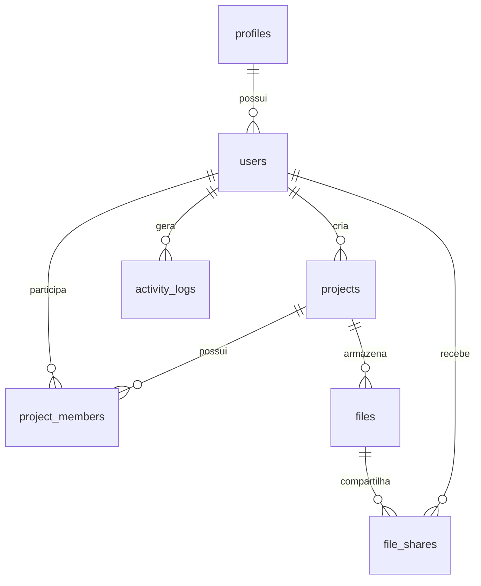

# Wiki Dev — SIGAC

> Documentação técnica consolidada do **Sistema de Gestão de Acesso ao Armazenamento Científico (SIGAC)**.
>
> A aplicação é dividida em duas partes independentes: [`frontend/`](frontend/), em Next.js, e [`backend/`](backend/), em FastAPI.

## Índice

- [1. Visão geral](#1-visão-geral)
- [2. Como executar](#2-como-executar)
- [3. SQLite passo a passo](#3-sqlite-passo-a-passo)
- [4. Estrutura do frontend](#4-estrutura-do-frontend)
- [5. Estrutura do backend](#5-estrutura-do-backend)
- [6. Banco de dados](#6-banco-de-dados)
- [7. Tabelas e campos](#7-tabelas-e-campos)
- [8. Modelagem e diagrama](#8-modelagem-e-diagrama)
- [9. API e endpoints](#9-api-e-endpoints)
- [10. Mapa API x frontend](#10-mapa-api-x-frontend)
- [11. Autenticação e permissões](#11-autenticação-e-permissões)
- [12. Padrões de desenvolvimento](#12-padrões-de-desenvolvimento)
- [13. Troubleshooting](#13-troubleshooting)
- [14. Deploy](#14-deploy)
- [15. Referências do repositório](#15-referências-do-repositório)

---

## 1. Visão geral

O SIGAC controla o acesso a projetos, arquivos científicos, membros, compartilhamentos e registros de auditoria.

### Responsabilidade de cada camada

- **Frontend:** telas, navegação, formulários, estados de carregamento, mensagens e interação com o usuário.
- **Backend:** API HTTP, validação, autenticação, autorização, regras de negócio, auditoria e acesso ao banco.
- **Banco:** persistência de usuários, perfis, projetos, arquivos, vínculos e logs.

O frontend nunca deve ser a única barreira de segurança. Toda permissão precisa ser conferida no backend.

### Fluxo de uma operação

1. O usuário acessa uma página em [`frontend/app/`](frontend/app/).
2. Um hook em [`frontend/hooks/`](frontend/hooks/) ou o cliente [`frontend/lib/api-client.ts`](frontend/lib/api-client.ts) envia uma requisição HTTP.
3. Um controller em [`backend/app/modules/`](backend/app/modules/) valida a requisição.
4. O backend consulta os models e aplica as regras de acesso.
5. A API retorna JSON.
6. O frontend atualiza loading, sucesso, erro ou estado vazio.

---

## 2. Como executar

Frontend e backend são aplicações independentes e devem ser iniciados em terminais separados.

### Pré-requisitos

- Python 3.11 ou superior;
- Node.js 20 ou superior;
- pnpm;
- SQLite 3 para desenvolvimento;
- PostgreSQL para ambientes compartilhados ou produção.

### Iniciar o backend

```bash
cd backend
python -m venv .venv

# Linux/macOS
source .venv/bin/activate

# Windows PowerShell
.venv\\Scripts\\Activate.ps1

pip install -r requirements.txt
cp .env.example .env
alembic upgrade head
uvicorn app.main:app --reload --host 0.0.0.0 --port 8080
```

### Iniciar o frontend

Em outro terminal:

```bash
cd frontend
pnpm install
```

Crie `frontend/.env.local`:

```env
NEXT_PUBLIC_API_BASE_URL=http://localhost:8080
```

Depois execute:

```bash
pnpm dev
```

### URLs importantes

| Recurso | URL |
|---|---|
| Aplicação | [http://localhost:3000](http://localhost:3000) |
| Login | [http://localhost:3000/login](http://localhost:3000/login) |
| Wiki visual | [http://localhost:3000/wiki-dev](http://localhost:3000/wiki-dev) |
| Swagger | [http://localhost:8080/docs](http://localhost:8080/docs) |
| ReDoc | [http://localhost:8080/redoc](http://localhost:8080/redoc) |
| OpenAPI JSON | [http://localhost:8080/openapi.json](http://localhost:8080/openapi.json) |
| Health check | [http://localhost:8080/health](http://localhost:8080/health) |

---

## 3. SQLite passo a passo

O SQLite é usado para desenvolvimento individual. O backend cria o diretório `backend/data`, aplica as migrations e executa o seed idempotente.

### Configuração mínima

No arquivo [`backend/.env`](backend/.env):

```env
DATABASE_ENGINE=sqlite
DATABASE_URL=sqlite+aiosqlite:///./data/sigac.db
SEED_DATABASE=true
CORS_ORIGINS=http://localhost:3000,http://127.0.0.1:3000
COOKIE_SECURE=false
ENVIRONMENT=development
```

O caminho `./data/sigac.db` é relativo ao diretório em que a API é iniciada. Execute o Uvicorn dentro de `backend/` para gerar:

```text
backend/data/sigac.db
```

### Criar e atualizar tabelas

```bash
cd backend
alembic upgrade head
alembic current
alembic history
```

A migration [`0002_remove_app_prefix.py`](backend/alembic/versions/0002_remove_app_prefix.py) renomeia bancos antigos que ainda possuam o prefixo `app_`, preservando os registros.

### Seed e login local

Na primeira execução, o seed cria perfis e usuários iniciais apenas quando eles ainda não existem. O login local exige que o e-mail esteja na tabela [`users`](#users).

### Visualizar dados

- Use o [Swagger](http://localhost:8080/docs) para consultar a API;
- Use o **DB Browser for SQLite** para abrir `backend/data/sigac.db`;
- Não coloque o `.db` dentro de `public/`;
- Não crie uma rota HTTP que entregue o arquivo SQLite diretamente.

### Resetar o banco local

> Esta operação apaga os dados locais.

```bash
rm backend/data/sigac.db
cd backend
alembic upgrade head
```

---

## 4. Estrutura do frontend

O frontend está em [`frontend/`](frontend/) e é uma instalação Next.js independente.

| Pasta/arquivo | Finalidade |
|---|---|
| [`frontend/app/`](frontend/app/) | Rotas, layouts, páginas e grupos de rotas do App Router. |
| [`frontend/app/(app)/`](frontend/app/(app)/) | Área autenticada da aplicação. |
| [`frontend/app/login/`](frontend/app/login/) | Página e fluxo visual de login. |
| [`frontend/app/wiki-dev/`](frontend/app/wiki-dev/) | Wiki técnica visual. |
| [`frontend/components/`](frontend/components/) | Componentes reutilizáveis de UI e domínio. |
| [`frontend/components/ui/`](frontend/components/ui/) | Componentes base do shadcn/ui. |
| [`frontend/hooks/`](frontend/hooks/) | Hooks para sessão, usuários, projetos, arquivos, permissões e logs. |
| [`frontend/lib/`](frontend/lib/) | Cliente HTTP, tipos, estado, navegação e utilitários. |
| [`frontend/lib/api-client.ts`](frontend/lib/api-client.ts) | Centraliza chamadas para a API. |
| [`frontend/public/`](frontend/public/) | Imagens, fontes e arquivos estáticos. |
| [`frontend/tests/`](frontend/tests/) | Testes E2E e verificações do frontend. |
| [`frontend/package.json`](frontend/package.json) | Scripts e dependências JavaScript. |
| [`frontend/tsconfig.json`](frontend/tsconfig.json) | Configuração do TypeScript e aliases. |
| [`frontend/next.config.mjs`](frontend/next.config.mjs) | Configuração do Next.js. |
| [`frontend/components.json`](frontend/components.json) | Configuração do shadcn/ui. |
| [`frontend/.env.local`](frontend/.env.local) | Variáveis locais não versionadas. |

### Comandos

```bash
cd frontend
pnpm install
pnpm dev
pnpm typecheck
pnpm lint
pnpm build
pnpm test:e2e
```

---

## 5. Estrutura do backend

O backend está em [`backend/`](backend/) e usa FastAPI, SQLAlchemy, Pydantic e Alembic.

| Pasta/arquivo | Finalidade |
|---|---|
| [`backend/app/`](backend/app/) | Pacote principal da aplicação Python. |
| [`backend/app/main.py`](backend/app/main.py) | Entry point ASGI usado pelo Uvicorn. |
| [`backend/app/app.py`](backend/app/app.py) | Monta a aplicação, middlewares, CORS e routers. |
| [`backend/app/core/`](backend/app/core/) | Configuração, ambiente, segurança e utilitários centrais. |
| [`backend/app/core/config.py`](backend/app/core/config.py) | Lê variáveis de ambiente e configura o sistema. |
| [`backend/app/api/`](backend/app/api/) | Dependências compartilhadas, sessão e autenticação das rotas. |
| [`backend/app/db/`](backend/app/db/) | Engine, sessão, Base SQLAlchemy e seed. |
| [`backend/app/modules/`](backend/app/modules/) | Domínios funcionais separados. |
| [`backend/app/modules/users/`](backend/app/modules/users/) | Usuários, perfis, login e permissões. |
| [`backend/app/modules/projects/`](backend/app/modules/projects/) | Projetos e membros. |
| [`backend/app/modules/files/`](backend/app/modules/files/) | Arquivos e compartilhamentos. |
| [`backend/app/modules/audit/`](backend/app/modules/audit/) | Logs de atividade e auditoria. |
| `module.py` | Registra o módulo e seus routers. |
| `models.py` | Define tabelas SQLAlchemy e relacionamentos. |
| `schemas.py` | Define entrada e saída com Pydantic. |
| `controller.py` | Define endpoints HTTP e respostas. |
| `service.py`/`repository.py` | Regras de negócio e acesso a dados, quando presentes. |
| [`backend/alembic/`](backend/alembic/) | Histórico de migrations do banco. |
| [`backend/alembic/env.py`](backend/alembic/env.py) | Conecta Alembic à configuração e metadata. |
| [`backend/alembic/versions/`](backend/alembic/versions/) | Migrations incrementais. |
| [`backend/data/`](backend/data/) | Arquivo SQLite local; não é armazenamento de produção. |
| [`backend/tests/`](backend/tests/) | Testes de contrato, schemas e integração. |
| [`backend/requirements.txt`](backend/requirements.txt) | Dependências Python. |
| [`backend/.env.example`](backend/.env.example) | Modelo de configuração local. |
| [`README.md`](README.md) | Documentação operacional única do frontend e backend. |

### Comandos de qualidade

```bash
cd backend
python -m compileall -q app alembic
python -m pip check
python -m pytest -q
ruff check .
```

---

## 6. Banco de dados

### Escolha do banco

- **SQLite:** simples, local e indicado para desenvolvimento individual.
- **PostgreSQL:** indicado para produção, múltiplas instâncias, backups, concorrência e ambientes compartilhados.

A troca deve ser feita por `DATABASE_ENGINE` e `DATABASE_URL`, sem espalhar URLs no código.

### Ciclo de mudança

1. Alterar o model SQLAlchemy;
2. Criar uma nova migration;
3. Revisar o SQL gerado;
4. Fazer backup do banco existente;
5. Aplicar a migration em uma cópia;
6. Executar testes;
7. Atualizar esta documentação.

Não altere uma migration que já foi aplicada. Crie outra migration incremental.

---

## 7. Tabelas e campos

> Os nomes físicos atuais não usam o prefixo `app_`.

### profiles

Catálogo de perfis e permissões.

| Campo | Descrição |
|---|---|
| `id` | Chave primária. |
| `name` | Nome do perfil. |
| `description` | Descrição funcional. |
| `permissions` | Permissões associadas. |
| `created_at`, `updated_at` | Auditoria temporal. |

Usada pela administração de perfis e pelo processo de autorização. Endpoints: `GET /api/profiles`, `POST/PATCH/DELETE /api/profiles/{id}` e `GET /api/permissions`.

### users

Usuários que podem iniciar sessão.

| Campo | Descrição |
|---|---|
| `id` | Chave primária. |
| `email` | E-mail único usado no login. |
| `name` | Nome de exibição. |
| `profile_id` | FK para `profiles.id`. |
| `is_active` | Indica se o usuário pode entrar. |
| `created_at`, `updated_at` | Auditoria temporal. |

Usada pelo login, sessão e administração de usuários. Endpoints: `POST /api/auth/login`, `GET /api/auth/session` e `GET/POST/PATCH/DELETE /api/users`.

### projects

Projetos científicos e metadados.

| Campo | Descrição |
|---|---|
| `id` | Chave primária. |
| `name` | Nome do projeto. |
| `description` | Descrição. |
| `owner_id` | FK para `users.id`. |
| `status` | Situação do projeto. |
| `created_at`, `updated_at` | Auditoria temporal. |

Usada em [`frontend/app/(app)/projetos/`](frontend/app/(app)/projetos/) e [`frontend/hooks/use-projects.ts`](frontend/hooks/use-projects.ts). Endpoints: `GET/POST /api/projects` e `GET/PATCH/DELETE /api/projects/{id}`.

### project_members

Associação entre usuários e projetos.

| Campo | Descrição |
|---|---|
| `id` | Chave primária. |
| `project_id` | FK para `projects.id`. |
| `user_id` | FK para `users.id`. |
| `role` | Papel do usuário no projeto. |
| `created_at` | Data da associação. |

Endpoints: `GET/POST /api/projects/{id}/members` e `DELETE /api/projects/{id}/members/{user_id}`.

### files

Metadados dos arquivos científicos.

| Campo | Descrição |
|---|---|
| `id` | Chave primária. |
| `project_id` | FK para `projects.id`. |
| `name` | Nome do arquivo. |
| `path` | Localização do arquivo. |
| `mime_type` | Tipo MIME. |
| `size` | Tamanho. |
| `uploaded_by` | FK para `users.id`. |
| `created_at`, `updated_at` | Auditoria temporal. |

Endpoints: `GET/POST /api/files` e `GET/PATCH/DELETE /api/files/{id}`.

### file_shares

Compartilhamentos e permissões concedidas para arquivos.

| Campo | Descrição |
|---|---|
| `id` | Chave primária. |
| `file_id` | FK para `files.id`. |
| `user_id` | FK para `users.id`. |
| `permission` | Tipo de acesso concedido. |
| `expires_at` | Expiração opcional. |
| `created_at` | Data da concessão. |

Endpoints: `GET/POST /api/files/{id}/shares` e `DELETE /api/files/{id}/shares/{user_id}`.

### activity_logs

Trilha de auditoria das operações.

| Campo | Descrição |
|---|---|
| `id` | Chave primária. |
| `user_id` | FK para `users.id`. |
| `action` | Ação executada. |
| `resource_type` | Tipo do recurso. |
| `resource_id` | Identificador do recurso. |
| `metadata` | Dados complementares. |
| `ip_address` | Origem da requisição. |
| `created_at` | Momento do evento. |

Usada em [`frontend/components/administracao/activity-log-table.tsx`](frontend/components/administracao/activity-log-table.tsx). Endpoint: `GET /api/activity-logs`.

### Como confirmar no código

- Models: [`backend/app/modules/*/models.py`](backend/app/modules/);
- Schema SQLite: [`database/sqlite-schema.sql`](database/sqlite-schema.sql);
- Migrations: [`backend/alembic/versions/`](backend/alembic/versions/);
- Schemas de API: `backend/app/modules/*/schemas.py`.

---

## 8. Modelagem e diagrama

O relacionamento central parte de `profiles` e `users`, chega a `projects`, usa tabelas de associação para membros e compartilhamentos e registra eventos em `activity_logs`.

### Diagrama ER

A fonte editável está em [`docs/database-erd.mmd`](docs/database-erd.mmd), e a imagem pronta em [`docs/database-erd.svg`](docs/database-erd.svg).



### Decisões de modelagem

- `project_members` e `file_shares` resolvem relações muitos-para-muitos;
- Essas tabelas também armazenam atributos da relação, como `role` e `permission`;
- `activity_logs` deve ser tratado como append-only;
- E-mails únicos impedem identidades duplicadas;
- FKs evitam registros órfãos, mas não substituem autorização no backend.

---

## 9. API e endpoints

A fonte viva do contrato é o [Swagger](http://localhost:8080/docs) e o arquivo [`OpenAPI JSON`](http://localhost:8080/openapi.json).

| Grupo | Endpoints | Finalidade |
|---|---|---|
| Saúde | `GET /health` | Verifica disponibilidade. |
| Login | `POST /api/auth/login` | Inicia sessão por e-mail. |
| Sessão | `GET /api/auth/session` | Retorna o usuário atual. |
| Logout | `POST /api/auth/logout` | Encerra sessão. |
| Usuários | `GET/POST /api/users`, `GET/PATCH/DELETE /api/users/{id}` | Administração de usuários. |
| Perfis | `GET /api/profiles`, `POST/PATCH/DELETE /api/profiles/{id}` | Perfis e permissões. |
| Permissões | `GET /api/permissions` | Consulta permissões disponíveis. |
| Projetos | `GET/POST /api/projects`, `GET/PATCH/DELETE /api/projects/{id}` | CRUD de projetos. |
| Membros | `GET/POST /api/projects/{id}/members`, `DELETE /api/projects/{id}/members/{user_id}` | Participantes. |
| Arquivos | `GET/POST /api/files`, `GET/PATCH/DELETE /api/files/{id}` | Metadados de arquivos. |
| Compartilhamentos | `GET/POST /api/files/{id}/shares`, `DELETE /api/files/{id}/shares/{user_id}` | Acessos a arquivos. |
| Auditoria | `GET /api/activity-logs` | Eventos do sistema. |
| Relatórios | `GET /api/reports/summary`, `GET /api/reports/projects` | Dados agregados. |

### Códigos HTTP

- `200`/`201`: sucesso;
- `400`: payload ou regra inválida;
- `401`: sessão ausente ou expirada;
- `403`: permissão insuficiente;
- `404`: recurso inexistente;
- `409`: conflito;
- `422`: validação Pydantic;
- `500`: erro inesperado.

---

## 10. Mapa API x frontend

| Domínio | API | Arquivos frontend |
|---|---|---|
| Cliente HTTP | Todos os endpoints | [`frontend/lib/api-client.ts`](frontend/lib/api-client.ts) |
| Sessão | `/api/auth/session` | [`frontend/hooks/use-session.ts`](frontend/hooks/use-session.ts), [`frontend/app/login/page.tsx`](frontend/app/login/page.tsx) |
| Usuários | `/api/users` | [`frontend/hooks/use-users.ts`](frontend/hooks/use-users.ts), componentes de administração |
| Permissões | `/api/permissions` | [`frontend/hooks/use-permissions.ts`](frontend/hooks/use-permissions.ts) |
| Projetos | `/api/projects` | [`frontend/hooks/use-projects.ts`](frontend/hooks/use-projects.ts), [`frontend/hooks/use-project.ts`](frontend/hooks/use-project.ts), páginas de projetos |
| Membros | `/api/projects/{id}/members` | [`frontend/hooks/use-project-members.ts`](frontend/hooks/use-project-members.ts) |
| Arquivos | `/api/files` | [`frontend/hooks/use-files.ts`](frontend/hooks/use-files.ts) |
| Auditoria | `/api/activity-logs` | [`frontend/hooks/use-activity-logs.ts`](frontend/hooks/use-activity-logs.ts), tabela de logs |
| Relatórios | `/api/reports/*` | [`frontend/app/(app)/relatorios/`](frontend/app/(app)/relatorios/) |

### Como rastrear uma chamada

1. Comece pelo hook;
2. Localize a função usada em `frontend/lib/api-client.ts`;
3. Procure o path no controller Python;
4. Identifique o schema e model consultados;
5. Confira as regras de sessão e autorização;
6. Atualize esta tabela quando criar uma nova integração.

---

## 11. Autenticação e permissões

O backend é a autoridade para identidade, sessão e autorização.

### Login

O login local recebe um e-mail, procura um usuário ativo em `users` e cria uma sessão protegida por cookie. Não existe cadastro automático pelo frontend.

### Perfis e escopo

O usuário possui um `profile_id` e permissões associadas. Cada consulta precisa validar:

- usuário autenticado;
- vínculo com o projeto;
- acesso ao arquivo;
- permissão para a ação solicitada.

### Boas práticas

- Usar HTTPS em produção;
- Habilitar cookies `Secure` em produção;
- Restringir CORS;
- Validar entradas com Pydantic;
- Usar queries parametrizadas;
- Não registrar tokens ou segredos nos logs;
- Nunca usar `localStorage` para sessão ou credenciais.

---

## 12. Padrões de desenvolvimento

### Nova tabela

Adicione model, migration, schema, repository/service, controller, testes e a entrada correspondente em [Tabelas e campos](#7-tabelas-e-campos). Teste banco vazio e banco já populado.

### Novo endpoint

Defina método, path, autenticação, payload, respostas e erros. Implemente o controller, conecte o hook do frontend, atualize o [Mapa API x frontend](#10-mapa-api-x-frontend) e valide no Swagger.

### Nova página

Crie a rota em `frontend/app/`, extraia componentes reutilizáveis, use tokens existentes e implemente loading, estado vazio, erro, acessibilidade e responsividade.

### Checklist

```bash
cd frontend
pnpm typecheck
pnpm lint
pnpm build
pnpm test:e2e

cd ../backend
python -m compileall -q app alembic
python -m pytest -q
```

---

## 13. Troubleshooting

### Preview não abre

Confirme que o Next foi iniciado dentro de `frontend/`, que `pnpm install` terminou e que a porta está livre. Reinicie o servidor após alterar `package.json` ou variáveis de ambiente.

### Frontend sem dados

Verifique:

1. Backend rodando em `localhost:8080`;
2. `NEXT_PUBLIC_API_BASE_URL` em `frontend/.env.local`;
3. `CORS_ORIGINS` incluindo `http://localhost:3000`;
4. [Health check](http://localhost:8080/health) respondendo;
5. Console e Network do navegador.

### SQLite ou migration falha

```bash
cd backend
alembic current
alembic history
```

Confira permissões de escrita em `backend/data/` e faça backup antes de qualquer rename.

### Erro 401 ou 403

- `401`: sessão ausente ou expirada;
- `403`: perfil sem permissão.

Confira o e-mail seed, cookies, CORS e autorização do controller. Não remova a proteção para contornar o erro.

### Build falha

Execute `pnpm typecheck`, `pnpm lint` e `pnpm build` separadamente. Corrija o primeiro erro real; mensagens posteriores podem ser consequência dele.

---

## 14. Deploy

Frontend e backend devem ser publicados como serviços separados.

### Frontend

Configure `NEXT_PUBLIC_API_BASE_URL` com a URL HTTPS pública da API. Execute o build dentro de `frontend/`. Não inclua `.env.local` ou segredos no bundle.

### Backend

Use PostgreSQL, aplique migrations como etapa controlada, restrinja CORS ao domínio do frontend, habilite cookies Secure, desative seed automático após a carga inicial e monitore `/health`.

### Release segura

1. Fazer backup;
2. Revisar migrations;
3. Validar variáveis;
4. Testar login e autorização;
5. Conferir logs sem dados sensíveis;
6. Monitorar erros;
7. Manter plano de rollback.

SQLite não deve ser usado como base persistente em uma implantação com múltiplas instâncias.

---

## 15. Referências do repositório

- [README único do projeto](README.md)
- [Estrutura do banco](docs/database-structure.txt)
- [Diagrama Mermaid](docs/database-erd.mmd)
- [Diagrama SVG](docs/database-erd.svg)
- [Endpoints documentados](docs/api-endpoints.md)
- [Arquitetura](docs/ARCHITECTURE.md)
- [Schema SQLite](database/sqlite-schema.sql)
- [Wiki visual](frontend/app/wiki-dev/page.tsx)

---

## Manutenção desta documentação

Ao alterar tabelas, endpoints, páginas, scripts ou estrutura de pastas, atualize este arquivo junto com a Wiki visual. Evite copiar blocos inteiros de outros documentos: mantenha aqui a referência consolidada e use links para a fonte técnica específica quando houver detalhes adicionais.
